---
title: "Marine Microplastics and Infant Health"
subtitle: |
  <span style="font-size: smaller;">
    Xinming Du, National University of Singapore <br>
    <strong>Shan (Evie) Zhang, Old Dominion University</strong> <br>
    Eric Zou, University of Michigan <br>
  </span> 
author: "Heartland 2024"
date: "27 Oct 2024"
output:
  xaringan::moon_reader:
    css: ['metropolis', 'metropolis-fonts', 'my-css.css']
    nature:
      slideNumberFormat: " "
      highlightStyle: github
      highlightLines: true
      countIncrementalSlides: false
---
exclude: true

```{R, setup, include = F}
library(pacman)
p_load(
  broom, tidyverse,
  ggplot2, ggthemes, ggforce, ggridges, cowplot,
  latex2exp, viridis, extrafont, gridExtra,
  kableExtra, snakecase, janitor,
  data.table, dplyr,
  lubridate, knitr, future, furrr,
  estimatr, FNN, parsnip,
  huxtable, here, magrittr
)
# Define colors
red_pink   = "#e64173"
turquoise  = "#20B2AA"
orange     = "#FFA500"
red        = "#fb6107"
blue       = "#3b3b9a"
green      = "#8bb174"
grey_light = "grey70"
grey_mid   = "grey50"
grey_dark  = "grey20"
purple     = "#6A5ACD"
slate      = "#314f4f"
# Knitr options
opts_chunk$set(
  comment = "#>",
  fig.align = "center",
  fig.height = 7,
  fig.width = 10.5,
  warning = F,
  message = F
)
opts_chunk$set(dev = "svg")
options(device = function(file, width, height) {
  svg(tempfile(), width = width, height = height)
})
options(knitr.table.format = "html")
```

---
layout: true
class: clear, top

---


## Introduction
<font size="4">
Plastic has gained exponential popularity since its invention in the 1900s.

- Many industrial and dialy uses

- Annual plastics production hit <span style="color:#8bb174">**400 million**</span> tons in 2022, with <span style="color:#8bb174">**40%**</span> used in packaging (Geyer, Jambeck, and Law, 2017).

- Unlike organic materials, plastics do not decompose but instead break down into increasingly smaller fragments.

- <span style="color:#8bb174">**80%**</span> of plastic waste accumulates in landfills or the environment.

- Between <span style="color:#8bb174">**4.8 and 12.7 million metric tons**</span> of plastic waste enter rivers and oceans annually (Jambeck et al., 2015).

<br/>
---

## Plastic Pollution Sources, Ambient Presence, and Exposure


.center[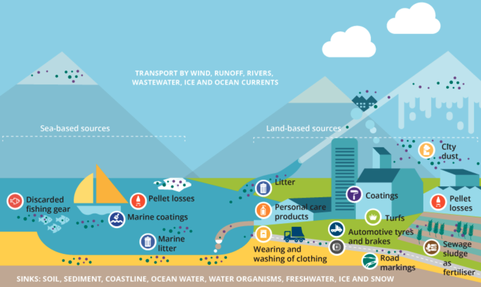]

<font size="2">
.center[Figure 1.(a) Plastic pollution sources (European Environment Agency, 2022)]
---

## Plastic Pollution Sources, Ambient Presence, and Exposure

<div style="text-align: center;">
  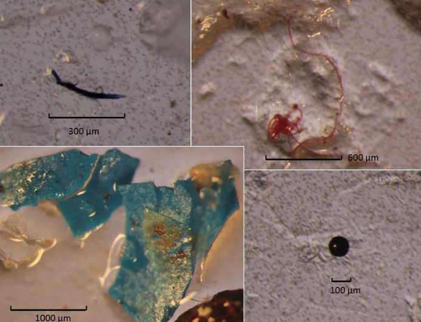
  <br>
  <font size="2"> Figure 1.(b) Microplastic ingestion in fish larvae (Steer et al., 2017)
</div>
---

## Plastic Pollution Sources, Ambient Presence, and Exposure

.center[]

<font size="2">
.center[Figure 1.(c) Airborne microplastic (Vianello et al., 2019)]
---

## Introduction
<font size="4">
Data on the health effects of microplastics remains scarce (Lim, 2021).

We present <span style="color:#8bb174">**the first global estimate of microplastic exposure's impact on infant health.**</span>

- Innovations in our approach include:

 - **New Measurement Technique**: space radar-based remote sensing to detect ocean surface microplastics by observing changes in surface roughness due to wind.

 - **Oceanic Transport Model**: day-to-day ocean current variability to predict microplastic movement from open seas to coasts, clarifying causal impacts.

 - **Data Integration**: microplastic data with birth records from 3 million infants across 15 countries and four continents.


---


## Current Knowledge
<font size="4">
**Emission Sources**: Oceans MPs stem from both land-based (80%) and ocean-based (20%) activities.

<span style="color:#8bb174">Redford et al., 1997; Browne et al., 2010; Cole et al., 2011; Good et al., 2010; Lee et al., 2013; Li et al., 2016; Eriksen et al., 2014; Jambeck et al., 2015; Van Sebille et al., 2015; Worm et al., 2017.</span>


**Ambient Presence**：MPs have been detected in water, soil, and air, reflecting widespread environmental dispersion.

<span style="color:#8bb174">Cauwenberghe et al., 2013; Cole et al., 2011; Cozar et al., 2014; Free et al., 2014; Rilling et al., 2012; Lwanga et al., 2016; Prata, 2018; Rodrigues et al., 2018; Li et al., 2019; Liu et al., 2019; Lehmann et al., 2021; Herb et al., 2023; Allen et al., 2020; Caracci et al., 2023.</span>

**Environmental Exposure**：MPs pose significant threats to both terrestrial and marine organisms.

<span style="color:#8bb174">Derraik, 2002; Ryan et al., 2009; Lozano and Mouat, 2009; van Franeker et al., 2011; Cole et al., 2011, 2013; Schuyler et al., 2014; Trevail et al., 2015; Avio et al., 2015; Carbery et al., 2018; Machado et al., 2019.</span>
---

## Current Knowledge
<font size="4">
Health Effects： Existing evidence showing the direct health consequences of MP exposure is very limited.

<span style="color:#8bb174">Yan et al. 2022</span>

- MP exposure and inflammatory digestive diseases
- 52 participants in Nanjing, China

<span style="color:#8bb174">Baeza and Martinez 2022</span> 

- Airborne MPs in human respiratory systems
- 44 patients in Spain

<span style="color:#8bb174">Amereh et al. 2022</span> 

- MPs are associated with birth outcomes
- 43 pregnant women in Iran

However, all three of these studies are based on **a small sample** in a specific region, and the results are mostly **correlational**.


---

## Contribution
<br>
<br>

- To our knowledge, this paper is the **first** to establish a direct link between ambient microplastic exposure and health using large-scale data.

<br>

- Our findings on microplastic aerosolization highlights a new, pervasive source of airborne particulate pollution and raise important questions about their broader impacts. 

<br>

- From a policy perspective, our research emphasizes the natures in which microplastic pollution is a global challenge.


---

## Data Sources: Ocean

<font size="4">

**Ocean Microplastic**： Our main microplastics measure is from Evans and Ruf (2021).

- Contains version 1.0 of the CYGNSS Level 3 ocean microplastic concentration data record, which reports daily on a 0.25-degree latitude/longitude spatial grid.

- The microplastic concentration number density is indirectly estimated by an empirical relationship between ocean surface roughness and wind speed. 

- In-situ measurement: NCEI Marine Microplastics by NOAA; contains ground information on the occurrence, distribution, and quantity of global microplastics.


**Ocean Currents**: Ocean Surface Current Analyses Real-time (OSCAR) product by NASA; provides daily information on current direction and speed at a resolution of 0.25 degrees. 

**Coastal Ocean Chlorophyll**: Ocean nutrient pollution data from Visible Infrared Imaging Radiometer Suite (VIIRS); provides daily observations with a spatial resolution of 4km, measured in mg per m3. 

---

## Remote-Sensing Microplastic Measurement: Summary

<div style="text-align: center;">
  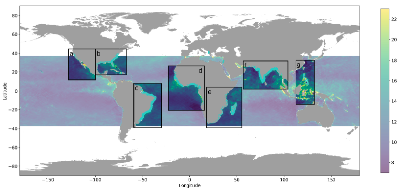
  <br>
  <font size="2"> Figure 2.(a) Global distribution
</div>

---

## Remote-Sensing Microplastic Measurement: Summary


<div style="text-align: center;">
  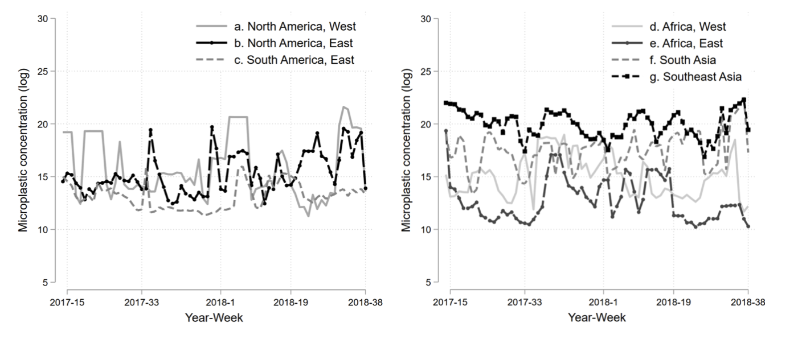
  <br>
  <font size="2"> Figure 2.(b) Time trends in study areas
</div>

---

## In-situ Microplastic Measurement: Validation


<div style="text-align: center;">
  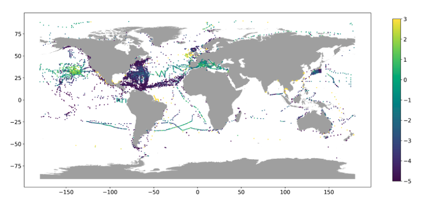
  <br>
  <font size="2"> Figure 3.(a) In-situ microplastic sampling locations
</div>

---

## Remote-Sensing Microplastic Measurement: Validation

.center[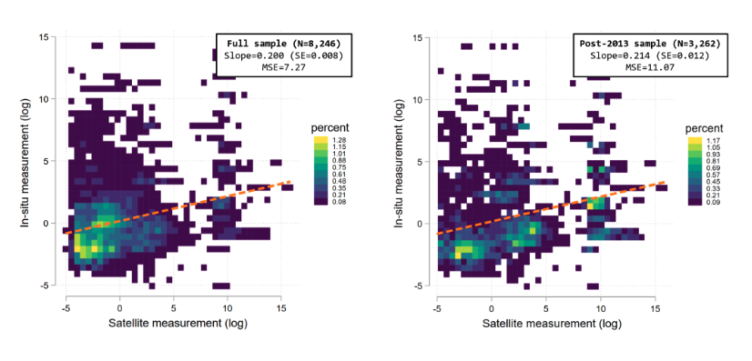]

<font size="2">
.center[Figure 3.(b) Correlation between in-situ and remote-sensing measurements]

---


## Data Sources: Atmospheric and Channels

<font size="4"> 

**Atmospheric Conditions**: Air pollution data from MERRA2---aerosol optical depth (AOD); depicts the concentration of aerosols in the atmosphere. 

**Evaporation**: NCEP/DOE (National Center for Atmospheric Research/Department of Energy) Reanalysis II product. 

**Meteorological condition**: Temperature and precipitation data form the European Centre for Medium-Range Weather Forecasts Reanalysis 5 (ERA5) products.

**Seafood Access**:
- Seafood consumption data in the US is sourced from the Nielsen consumer panel, which consists of a representative panel of households continuously providing information about their purchases in a longitudinal study.

- Fishery effort data is obtained from Global Fishing Watch.


---

## Data Sources: Birth

<font size="4"> 
**DHS**: Birth Demographic and Health Survey

The DHS data includes birth records from 12 coastal countries obtained through 14 surveys, with a total number of 10,545 births. 

**US**: National Vital Statistics System (NVSS)

The NVSS data includes birth records from 461 coastal counties with 934,081 births.

**Mexico**: Mexican National Health System

The data contains birth records from 1,221 coastal municipals with 725,726 birth records.


**Brazil**: Brazil Live Birth Information System (SINASC) 

The data contains birth records from 2,419 coastal municipals with 1,344,769 birth records.

---


## Econometric Setup 1
Our goal is to estimate the causal impact of microplastic exposure while in utero on birth outcome. The econometric equation is as follows:

$$
\begin{align*}
\text{Low Birth Weight}_{i,c,t} = \beta \cdot \log \left( \sum_{k=1}^9 \text{Microplastics}_{c,t+k} \right) + \alpha_c + \alpha_t + X_{c,t} + \gamma + \epsilon_{ict}
\end{align*}
$$
<font size="4"> 
- $\text{Low Birth Weight}_{i,c,t}$ is an indicator variable for whether birth  occurring in region  at month  is weighing less than 2,500 grams. 

- $\sum_{k=1}^9 \text{Microplastics}_{c,t+k}$ captures i’s exposure to microplastics while in utero, which equals the logged sum of microplastic levels observed at th nearest coastal sea grid to location  over the 9-month period preceding i’s birth.

- $X_{c,t}$ time-varying environmental covariates, including tempetarure, precipitation, aerosol pollution, and ocean chlorophyll-a (ocean water pollution)

- $\alpha_c$ are region (admin1) fixed effects

- $\alpha_t$ are country by month-of-sample fixed effects 
---

## Econometric Challenge

<font size="4"> 

Challenge: Potential endogeneity from third factors affecting birth outcomes, not accounted for by fixed effects and co-pollutant controls.

- We address these concerns in several ways.

 - <span style="color:#8bb174">**Alternative Exposure Measures**</span>: Using alternative in-utero microplastic exposure to leverage the quasi-random variation that comes from ocean dynamics.
 
 
 - Ocean Current Dynamic Model: Computes predicted coastal microplastic concentrations from microplastics transported from areas at least 200 km from the coast.Incorporates observed concentrations and ocean currents data to simulate how far-sea microplastics migrate towards coastal zones.
 
 - The source of variation—microplastic variation far from land and changes in ocean currents—should <span style="color:#8bb174">**have little to do**</span> with coastal birth weights except through their influence on coastal microplastic variability.


---


## Econometric Setup 2

<font size="4"> 

**Exogenous Exposure Measure**: Develop a measure of microplastic exposure from deep sea areas to coastal regions, minimizing correlation with coastal activities.

- **Ocean Current Flow Intensity Matrix**: Applies an oceanography model to quantify the flow of microplastics based on ocean current dynamics.

- **Variable Definition**: `\( MP_{i \rightarrow r, m} \)` represents the intensity of microplastics transported from a sender grid to a receiver coastal grid during a specific month.

Spatial Representation of Current Flows: Generate maps from individual current vectors by following the daily speed and direction, creating streamlines that represent the trajectory of ocean currents.

Deep Sea Senders Identification: Define sender grids based on their distance from coastal areas, using 200 km as the cutoff.

---

## Microplastic Transport Modeling

<font size="4">

Downstream Intensity Score: Establish a scoring system to measure the intensity of microplastics transported from each sender to coastal receivers.

$$
\begin{align*}
\text{Current}_{i,r,d,t} = \exp \left( -\alpha \cdot \text{rad}_{i,r,d,t} - \beta \cdot | \theta |_{i \rightarrow r,d,t} - \gamma \cdot \text{dist}_{i,r,d,t} \right)
\end{align*}
$$
$$
\begin{align*}
\text{Current}_{i,r,d'} = \sum_{d+t=d'} \text{Current}_{i,r,d,t}
\end{align*}
$$
- Average this city pair-daily score to the monthly frequency to make the size of the regression dataset manageable.

- Calculate the imported microplastics concentrations $MP_{i,r,m}$ by multiplying $Current_{i,r,m}$ with $MP_{i,m}$.

- Aggregate all sender grids, and use $\sum_{i}MP_{i \rightarrow r,m}$ as an exogenous regressor to measure total transported microplastics received by grid in month and to estimate its impact on coastal human health.
---

## Exogenous MPs Exposure

<div style="text-align: center;">
  
</div>

---

## Exogenous MPs Exposure


.center[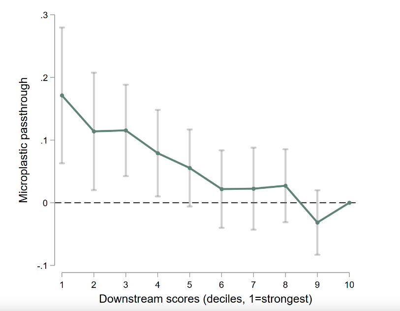]

<font size="2">
.center[Appendix Figure 2. Passthrough of Microplastic from Ocean to Coastal Locations by Downstream Score Deciles]
---

## Main Results
<br>
<br>

.center[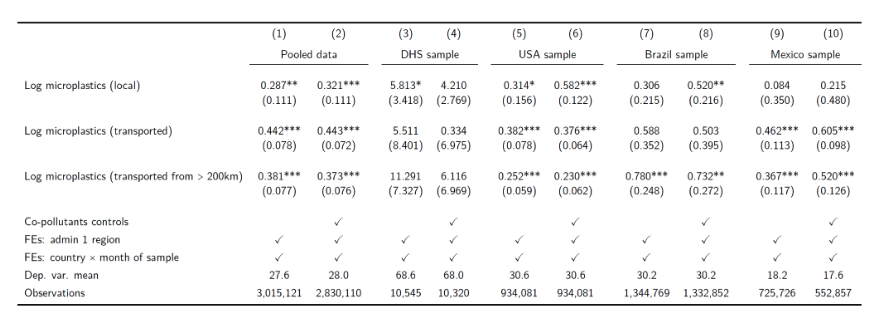]

<font size="2">
.center[Table 1. The Effect of In-Utero Microplastic Exposure on Low Birth Weight]

- Estimates using local versus transported microplastic measures yield similar results, indicating minimal issues with endogeneity, such as omitted variable biases.
---

## Econometric Setup 3
- Replace the in-utero, 9-month microplastic exposure with separate trimester exposure terms. 
- Include preconception and postpartum "placebo" terms

$$
\begin{align*}
\text{Low Birth Weight}_{i,c,t} &= \beta_{\text{Preconception}} \cdot \log \left( \sum_{k=-10}^{-12} \text{Microplastics}_{c,t+k} \right) \\
&\quad + \beta_{\text{1st Trimester}} \cdot \log \left( \sum_{k=-7}^{-9} \text{Microplastics}_{c,t+k} \right) \\
&\quad + \beta_{\text{2nd Trimester}} \cdot \log \left( \sum_{k=-4}^{-6} \text{Microplastics}_{c,t+k} \right) \\
&\quad + \beta_{\text{3rd Trimester}} \cdot \log \left( \sum_{k=-1}^{-3} \text{Microplastics}_{c,t+k} \right) \\
&\quad + \beta_{\text{Postpartum}} \cdot \log \left( \sum_{k=0}^{2} \text{Microplastics}_{c,t+k} \right) \\
&\quad + \alpha_c + \alpha_t + X_{c,t} + \gamma + \epsilon_{ict}
\end{align*}
$$
---


## Main Results

.center[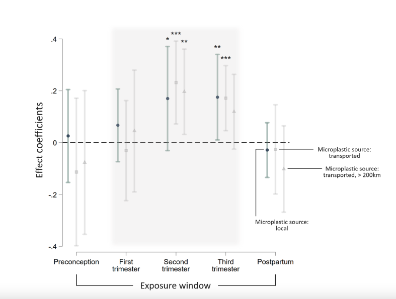]

<font size="2">
.center[Figure 5. The Effect of In-Utero Microplastic Exposure on Low Birth Weight]

---


## Channels
How does in-utero exposure to microplastics cause low birth weight? 

<br>
<br>
<br>


**Access to Seafood**

- Microplastics accumulate in sea animals and are ingested by humans through seafood.
 - county-level seafood spending per capita
 - 2017-2018 average fishing hours as a proxy for access to seafood


---

##  Channel Analysis: Access to Seafood

.center[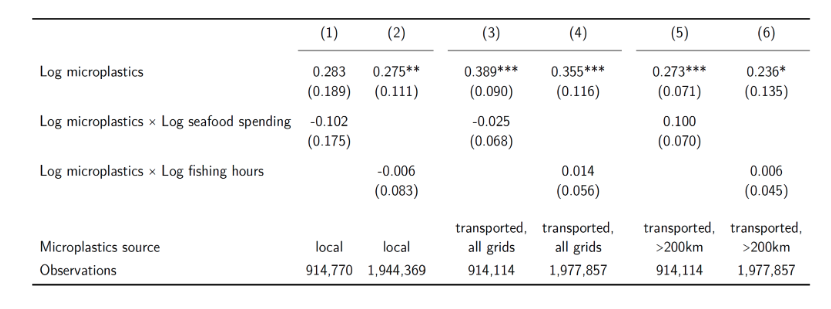]

<font size="2">
.center[Table 2. Heterogeneous impacts of microplastic exposure by seafood access.]

<div style="text-align: center;">
  
  <br>
  <font size="2"> Supplemental Table 1. Impacts of Local versus Seafood Exporter Countries’ Microplastics on Low Birth Weight (USA Sample)
</div>

---

## Channel Analysis: Aerosolization

**Aerosolization**

- Small microplastics can become airborne and inhaled, similar to fine particulate matter, penetrating human organs via the respiratory tract.
 - under suitable atmospheric conditions---evaporation
 
<br>
<br>

.center[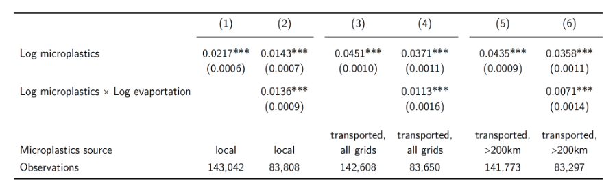]

<font size="2">
.center[Table 3. Aerosolization of coastal microplastics]
---


## Results 
<font size="4">
  
- We find robust evidence that in-utero exposure to microplastics significantly increases the likelihood of low birth weight (LBW) among mothers who lived within 200 km of the coastal line.


 - Each doubling of microplastic concentration during pregnancy increases LBW incidents by <span style="color:#8bb174">**3.7 per 1,000 births**</span>.  - This effect is primarily driven by exposure during the second and third trimesters.
 
 - No impact of microplastic exposure during the preconception and postpartum periods. 
 
<br/>
<br/>

- The effect size we find is significant

 - Microplastic variability accounts for about <span style="color:#8bb174">**2 percent**</span> of all low birth weight births. 
 - This rate ranges from approximately <span style="color:#8bb174">**1.2 percent**</span> in the USA to over <span style="color:#8bb174">**8 percent**</span> in certain developing countries in Africa and South Asia.

 - Scaled linearly, our estimate implies that about <span style="color:#8bb174">**205,800**</span> of LBW coastal births annually worldwide can be attributed to microplastic exposure.


---


## Results

Mechanisms Linking Microplastics and Infant Health

- Pathways: Water and Air

 - **Water**: microplastics accumulate in water bodies and enter diets via contaminated seafood.
 
<span style="color:#8bb174"> No statistically significant evidence that areas with higher seafood access are associated with a larger health effect</span>

-  

 - **Air**: variations in microplastic levels strongly predict the concentration of coastal aerosol particulate pollution, as measured by an independent satellite instrument. 
 
<span style="color:#8bb174"> This relationship intensifies with higher rates of evaporation in coastal regions.</span>
---

## Conclusion

<br>
<br>

- Decades of academic and policy discussions on plastic pollution, yet limited direct evidence on health effects.

<br>

- Growing availability of high-resolution measurements of microplastics, oceanic motion,and health, as well as methods that are able to identify causal signals in these data, may help close this gap.

<br>

- Our initial study in infant health settings indicate significant health implications of microplastic exposure, corroborating concerns raised by multiple scientific disciplines.

---


## Thank you!

**Questions and suggestions?**

<font size="3">

.center[Shan (Evie) Zhang  <br> Department of Economics  <br> Old Dominion University  <br> s2zhang@odu.edu]


<div style="text-align: center;">
  
  <br>
</div>


